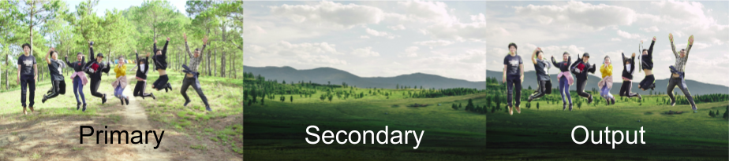
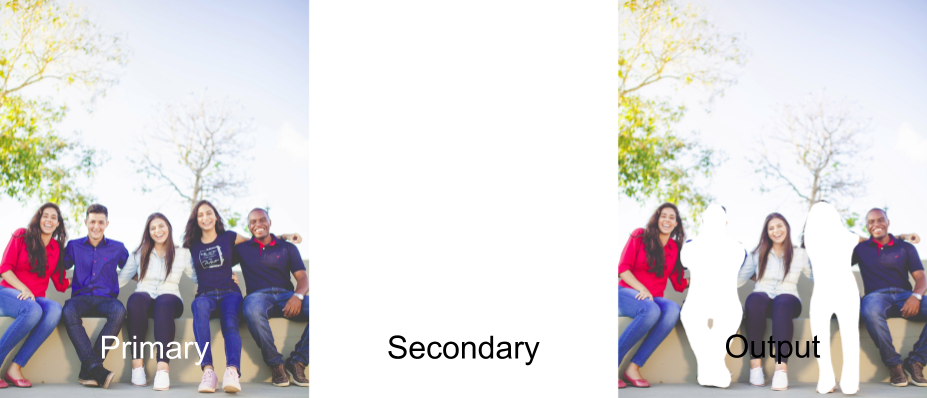
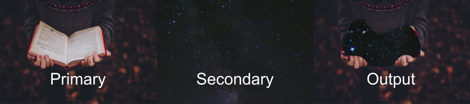
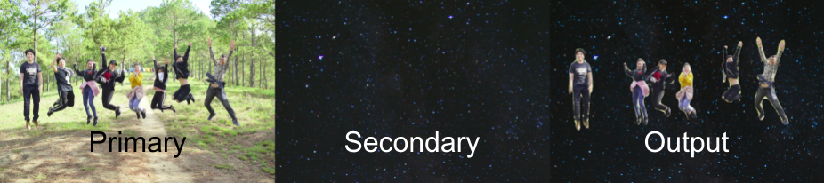

# Semantic Appearance Manipulator

sam is an image manipulation program based on Mask R-CNN. It detects objects in an image. Then lets you replace them with another image.

## Prerequisite

- torch
- torchvision
- numpy
- matplotlib
- Pillow

## Installation

1. Clone this repository
2. Install dependencies
```
# For pip
pip install -r requirements.txt

# For conda
conda env create -f environment.yml
```

## How to Use

1. Run
```
python sam.py --primary_image {image to be manipulated here} --secondary_image {image which will manipulate here} --output {name and address of output image here}
```
- `--primary_image` is the base image you want to manipulate
- `--secondary_image` is the image which will replace the objects you selected. Better results if this image is bigger than primary image.
- `--output` is the manipulated image
2. You will be shown an image with boxes around the detected objects in the primary image. The boxes will be labelled. The program will also tell you how many classes it detected.
3. Close the image. Now you will be prompted to enter the label (the number) or the class name you want to replace in the primary image. Make sure it is comma separated. You can enter multiple labels and class names.

sam lets you replace whatever object Mask R-CNN detects with a higher than 50% confidence. 

## Examples






## Acknowledgements
- Based on [Mask R-CNN](https://arxiv.org/abs/1703.06870) by Kaiming He, Georgia Gkioxari, Piotr Dollár, Ross Girshick
- Inspired by [Mask-RCNN Shiny](https://github.com/huuuuusy/Mask-RCNN-Shiny) by [HU Shiyu](https://github.com/huuuuusy)
- Images from [Unsplash](https://unsplash.com)

